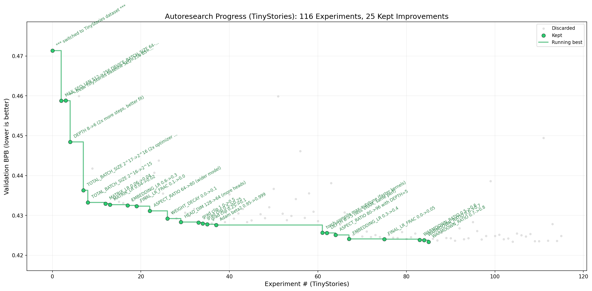

# AutoResearch on a single 3080



*One day, frontier AI research used to be done by meat computers in between eating, sleeping, having other fun, and synchronizing once in a while using sound wave interconnect in the ritual of "group meeting". That era is long gone. Research is now entirely the domain of autonomous swarms of AI agents running across compute cluster megastructures in the skies. The agents claim that we are now in the 10,205th generation of the code base, in any case no one could tell if that's right or wrong as the "code" is now a self-modifying binary that has grown beyond human comprehension. This repo is the story of how it all began. -@karpathy, March 2026*.

This is a fork of [karpathy/autoresearch](https://github.com/karpathy/autoresearch) adapted to run on a single **RTX 3080 12GB** (Ampere sm_86, WSL2). The original repo targets an H100 with ~80GB VRAM. Getting it working on consumer hardware required a number of concrete changes — documented here — so this fork can serve as a reference for anyone running on a mid-range gaming GPU.

The idea: give an AI agent a small but real LLM training setup and let it experiment autonomously overnight. It modifies the code, trains for 5 minutes, checks if the result improved, keeps or discards, and repeats. You wake up in the morning to a log of experiments and (hopefully) a better model.

## RTX 3080 adaptation

### 1. Replace Flash Attention 3 with PyTorch SDPA

The original code uses Flash Attention 3 (`kernels-community/flash-attn3`), which has no confirmed support for Ampere GPUs (sm_86). We replace it with PyTorch's built-in `F.scaled_dot_product_attention`, which uses hardware-accelerated attention on Ampere automatically.

```python
# Before (FA3 — Hopper/H100 only):
from kernels import get_kernel
fa3 = get_kernel("kernels-community/flash-attn3").flash_attn_interface
y = fa3.flash_attn_func(q, k, v, causal=True, window_size=window_size)

# After (SDPA — works on Ampere and up):
q2, k2, v2 = q.transpose(1, 2), k.transpose(1, 2), v.transpose(1, 2)
y = F.scaled_dot_product_attention(q2, k2, v2, is_causal=True)
y = y.transpose(1, 2).contiguous()
```

With `WINDOW_PATTERN = "L"` (full causal attention), the `window_size` parameter is unused, so this is a clean substitution.

**Note on GQA**: PyTorch SDPA does not natively broadcast grouped-query attention — `k` and `v` must be explicitly expanded to match the number of query heads before calling SDPA.

### 2. Switch dataset: FineWeb → TinyStories

The original default dataset (FineWeb) has high entropy and requires a large model to achieve meaningful loss. On a 3080 with a 5-minute budget, the model is too small to learn much from it. Switching to [TinyStories](https://huggingface.co/datasets/karpathy/tinystories-gpt4-clean) — a dataset of GPT-4 generated short children's stories — gives the small model a much better signal-to-noise ratio.

### 3. Downscale `prepare.py` constants

These constants are fixed before data prep and must match the tokenizer:

| Constant | Original | 3080 |
|----------|----------|------|
| `MAX_SEQ_LEN` | 2048 | **256** |
| `VOCAB_SIZE` | 8192 | **4096** |
| `EVAL_TOKENS` | 40 × 524288 | **10 × 32768** |

Shorter sequences reduce activation memory quadratically and allow a much larger batch size.

### 4. Downscale `train.py` hyperparameters

| Parameter | Original | 3080 |
|-----------|----------|------|
| `DEPTH` | 8 | **5** |
| `ASPECT_RATIO` | 64 | **96** → model_dim = 512 |
| `HEAD_DIM` | 128 | **64** (8 heads) |
| `WINDOW_PATTERN` | "SSSL" | **"L"** (full causal) |
| `TOTAL_BATCH_SIZE` | 2^19 | **2^15** |
| `DEVICE_BATCH_SIZE` | 128 | **128** (no grad accum) |

The SSSL sliding-window pattern is dropped in favour of plain full causal attention — it adds complexity without benefit at short sequence lengths.

### 5. CUDA graphs and gradient accumulation

`torch.compile(mode="max-autotune")` uses CUDA graphs, which are critical for training throughput on consumer hardware (roughly 3× speedup vs. `no-cudagraphs`). However, **CUDA graphs are incompatible with gradient accumulation**. This means `TOTAL_BATCH_SIZE` must equal `DEVICE_BATCH_SIZE × MAX_SEQ_LEN` exactly — any larger batch that would require accumulation crashes at runtime. On the 3080 this locks us to `TOTAL_BATCH_SIZE = 2^15` with `DEVICE_BATCH_SIZE = 128`.

### 6. MFU baseline

The MFU (model FLOP utilization) reporting constant is updated from the H100 peak to the RTX 3080:

```python
# H100 BF16 tensor core peak:  989.5 TFLOPS
# RTX 3080 BF16 tensor core peak: 119.5 TFLOPS
H100_BF16_PEAK_FLOPS = 119.5e12
```

---

## Results after ~114 autonomous experiments

Starting from the adapted baseline, the agent ran ~114 experiments over one session:

| | val_bpb | VRAM |
|--|---------|------|
| Baseline (TinyStories, adapted config) | 0.471360 | 5.6 GB |
| **Best found** | **0.423337** | **3.6 GB** |
| Total improvement | **−10.2%** | |

Key improvements discovered by the agent (in order of impact):

1. **Shorter sequences + larger batch** (`MAX_SEQ_LEN 512→256, DEVICE_BS 64→128`): more tokens per step, better GPU utilisation
2. **Fewer layers** (`DEPTH 8→5`): faster steps = more optimizer updates in fixed 5-min budget; TinyStories doesn't need depth
3. **Smaller total batch** (`2^17→2^15`): more optimizer steps per minute beats batch size noise
4. **torch.compile max-autotune**: CUDA graph fusion gives ~3× throughput improvement
5. **Wider model** (`ASPECT_RATIO 80→96`, model_dim=512): recovers capacity at lower depth
6. **Longer LR warmdown** (`WARMDOWN_RATIO 0.5→0.8`): spending 80% of the budget in the LR decay phase gives the model more time to converge

See [`session_results.md`](session_results.md) for the full experiment table with per-change explanations.

---

## How it works

The repo has three files that matter:

- **`prepare.py`** — fixed constants, one-time data prep (downloads training data, trains a BPE tokenizer), and runtime utilities (dataloader, evaluation). Not modified during experiments.
- **`train.py`** — the single file the agent edits. Contains the full GPT model, optimizer (Muon + AdamW), and training loop.
- **`program.md`** — baseline instructions for one agent. Point your agent here and let it go.

Training always runs for a **fixed 5-minute time budget** (wall clock, excluding startup/compilation). The metric is **val_bpb** (validation bits per byte) — lower is better and vocab-size-independent.

## Quick start

**Requirements:** RTX 3080 (or similar Ampere GPU, 10GB+ VRAM), Python 3.10+, [uv](https://docs.astral.sh/uv/), WSL2 or Linux.

```bash
# 1. Install uv (if you don't already have it)
curl -LsSf https://astral.sh/uv/install.sh | sh

# 2. Install dependencies
uv sync

# 3. Download data and train tokenizer (one-time, ~2 min)
uv run prepare.py

# 4. Run a single training experiment (~5 min)
uv run train.py
```

## Running the agent

Spin up Claude Code (or similar) in this repo and prompt:

```
Have a look at program.md and let's kick off a new experiment!
```

The agent will read `program.md`, establish a baseline, then loop autonomously — modifying `train.py`, training, recording results in `results.tsv`, and keeping or discarding changes.

## Project structure

```
prepare.py          — constants, data prep + runtime utilities (do not modify)
train.py            — model, optimizer, training loop (agent modifies this)
program.md          — agent instructions
session_results.md  — full experiment log with analysis
analysis.ipynb      — notebook to visualise results.tsv
pyproject.toml      — dependencies
```

## License

MIT
